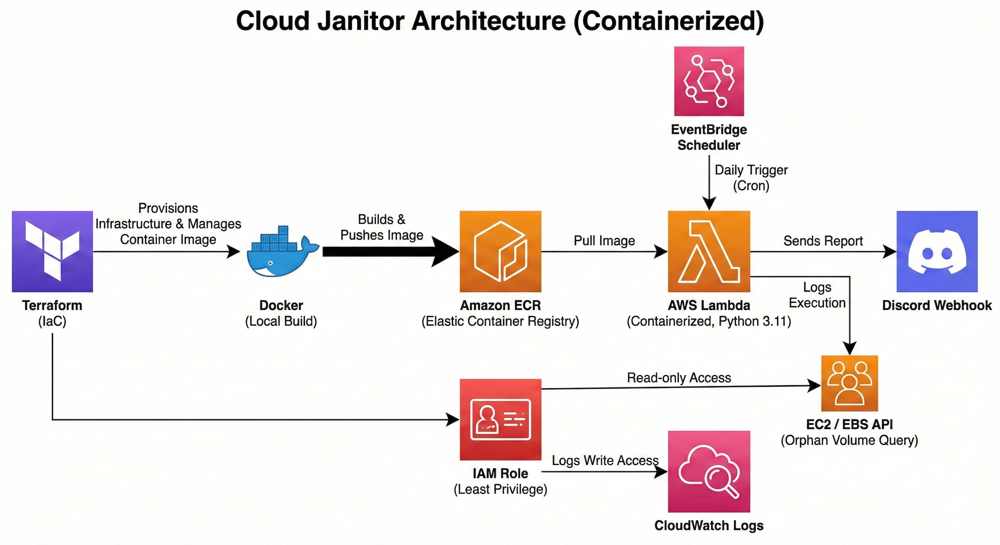
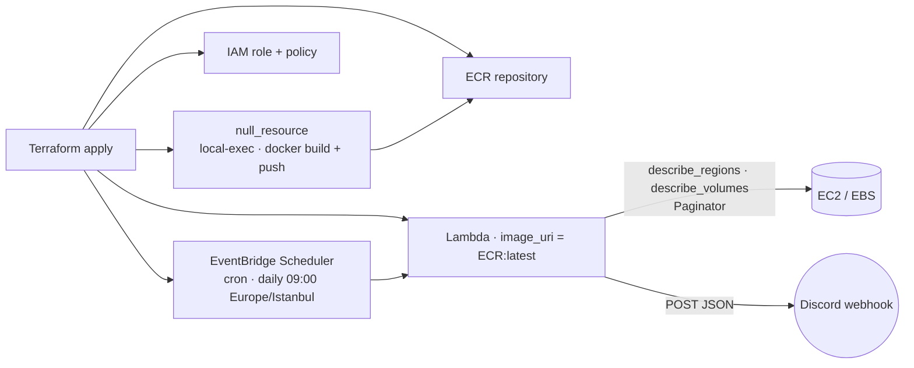

# Cloud Janitor — EBS Scan

[](https://github.com/emredogan-cloud/cloud-janitor-ebs-scan/actions/workflows/main.yaml)

Container-image-based AWS Lambda, provisioned end-to-end with **Terraform**, that scans one or more regions daily for **orphan EBS volumes**, estimates monthly storage cost, and posts a consolidated report to a Discord channel via webhook.

The interesting piece is the build path: Terraform owns not just the AWS resources but also the **Docker image build, the ECR push, and the Lambda image association** — one `terraform apply` from a clean account to a running job.





---

## What it does

- Reads `REGIONS` env var: a CSV list (`us-east-1,eu-west-1,…`) or the literal string `ALL` to auto-discover via `ec2.describe_regions`.
- For each region, paginates `describe_volumes` with `state=available`.
- Computes a per-volume monthly cost using a static `gp2 / gp3 / io1 / io2 / st1 / sc1` rate table.
- Aggregates into a Discord message (chunked at 1900 chars per request) and POSTs to `DISCORD_WEBHOOK_URL`.

---

## Repository Layout

```
cloud-janitor-ebs-scan/
├── Dockerfile                       # public.ecr.aws/lambda/python:3.12 base
├── src/
│   └── lambda_function.py           # handler + cost estimator + Discord client
├── terraform/
│   ├── main.tf                      # providers
│   ├── backend.tf                   # remote state config
│   ├── ecr.tf                       # ECR repo + lifecycle
│   ├── iam.tf                       # Lambda exec role + EC2 read + logs
│   ├── lambda.tf                    # aws_lambda_function · package_type = Image
│   ├── scheduler.tf                 # EventBridge Scheduler cron
│   ├── outputs.tf
│   ├── variables.tf
│   └── terraform.tfvars             # local values (gitignore in real deployments)
├── backend-bootstrap/               # one-time S3 + DynamoDB state backend bootstrap
├── requirements.txt
└── LICENSE
```

---

## Deploy

Prerequisites: Terraform ≥ 1.5, Docker, AWS CLI, an existing S3 + DynamoDB state backend (or `backend "local"`).

```bash
cd terraform

terraform init

# terraform.tfvars
#   aws_region  = "eu-west-1"
#   lambda_vars = {
#     DISCORD_WEBHOOK_URL = "https://discord.com/api/webhooks/..."
#     REGIONS             = "ALL"
#   }

terraform plan
terraform apply
```

The `null_resource.docker_build_push` step inside `lambda.tf` triggers a local `docker build` + `aws ecr get-login-password | docker login` + `docker push` so the image is in ECR before the Lambda is created. `depends_on` keeps the ordering deterministic.

### Updating the handler

Edit `src/lambda_function.py`, then:

```bash
terraform apply
```

The `null_resource` triggers on source hash, rebuilds the image, pushes the new `:latest` tag, and updates the Lambda function's `image_uri`.

### Tear down

```bash
terraform destroy
```

---

## Lambda Runtime

| Setting | Value |
|---|---|
| Base image | `public.ecr.aws/lambda/python:3.12` |
| Handler | `lambda_function.lambda_handler` |
| Memory | 512 MB |
| Timeout | 300 s |
| Env vars | `DISCORD_WEBHOOK_URL`, `REGIONS` |
| Schedule | `cron(0 9 * * ? *)` Europe/Istanbul (via EventBridge Scheduler) |

EBS pricing in `lambda_function.py` is a static table (`gp3: $0.08/GiB·mo`, …). Update when AWS changes list prices — there is intentionally no live pricing API call so the scan stays fast and offline-tolerant.

---

## Required IAM

The Lambda role (built in `terraform/iam.tf`) needs:

- `AWSLambdaBasicExecutionRole` (CloudWatch Logs)
- `ec2:DescribeRegions`, `ec2:DescribeVolumes` on `*`

Discord requires no AWS permissions — auth is the webhook secret itself, kept out of Git through `terraform.tfvars`.

---

## Design Notes

- **One tool owns one runtime.** Terraform owns the AWS resources and the build step. There is no separate CI artifact to push.
- **Image-based Lambda.** Same dependency story locally and in the cloud — no `pip install --target` voodoo, no zip-size cliff.
- **Webhook fan-out, not SNS.** Discord was the consumer; SNS adds latency and email subscriptions weren't useful for the team. Swap by replacing `send_to_discord` with an SNS publish.
- **Chunked POST.** Discord's 2000-char limit is handled in 1900-char slices to leave headroom for the username prefix.

---

## License

[MIT](LICENSE)
