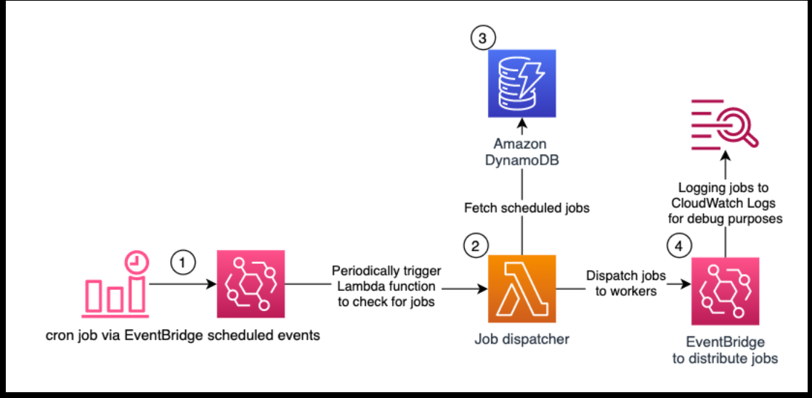

# 📉 Cloud Janitor – Orphan EBS Scanner
> **Serverless AWS cost visibility automation using Terraform**


*(Note: Please ensure the architecture diagram is placed in `docs/architecture.png`,`docs/architecture2.png`,`docs/architecture3.png` )*

---

## 📖 Project Description

**Cloud Janitor** is a fully serverless AWS automation tool designed to identify **orphaned EBS volumes** (volumes in `available` state), estimate their **monthly storage cost**, and deliver a consolidated report to **Discord**.

The solution is provisioned entirely using **Terraform (IaC)** and runs on a **daily schedule** via **EventBridge Scheduler**, requiring no servers, no manual execution, and minimal operational overhead.

### Key Features & Skills Demonstrated
- ✅ **Infrastructure as Code:** Full lifecycle management with Terraform.
- ✅ **Serverless Architecture:** AWS Lambda & EventBridge for zero-maintenance compute.
- ✅ **FinOps Mindset:** Automated cost estimation and resource optimization.
- ✅ **Multi-Region Support:** Scans resources across multiple AWS regions simultaneously.
- ✅ **Least Privilege Security:** Granular IAM policies for minimal access scope.

---

## ⚙️ High-Level Flow

1. **Terraform** provisions all infrastructure (IAM, Lambda, Scheduler).
2. **EventBridge Scheduler** triggers the Lambda function daily at **09:00 (Europe/Istanbul)**.
3. **AWS Lambda** executes the logic:
   - Reads target regions from environment variables.
   - Queries EC2 APIs for orphaned EBS volumes via `boto3`.
   - Estimates monthly storage cost per volume based on type (gp2, gp3, io1, etc.).
   - Aggregates results into a structured report.
4. **Discord Webhook** receives the formatted cost and inventory report.
5. **CloudWatch Logs** capture execution details for observability.

---

## 🏗 Architecture Components

| Component | Description |
|-----------|-------------|
| **AWS Lambda** | Python 3.12 runtime. Stateless execution logic with multi-region scanning capability. |
| **EventBridge** | Cron-based scheduler (Timezone-aware) to trigger the audit process. |
| **IAM** | **Least Privilege Design:** Lambda can only *describe* volumes and write logs. It cannot delete resources. |
| **Terraform** | Manages the state and deployment of all AWS resources. |

---

## 🛠️ Prerequisites

Before deploying, ensure you have the following installed:
* [AWS CLI](https://aws.amazon.com/cli/) (Configured with credentials)
* [Terraform](https://www.terraform.io/downloads) (v1.0+)
* A valid **Discord Webhook URL** (See: [Discord Intro to Webhooks](https://support.discord.com/hc/en-us/articles/228383668-Intro-to-Webhooks))

---

## 🚀 Deployment Guide

### 1. Clone the Repository
```bash
git clone [https://github.com/emredogan-cloud/aws-cloud-janitor.git](https://github.com/emredogan-cloud/aws-cloud-janitor.git)
cd aws-cloud-janitor

2. Configure Secrets

    ⚠️ Security Note: Never commit secrets to version control.

Create a local terraform.tfvars file (this file is git-ignored by default):

# terraform.tfvars
lambda_vars = {
  DISCORD_WEBHOOK_URL = "[https://discord.com/api/webhooks/YOUR_WEBHOOK_HERE](https://discord.com/api/webhooks/YOUR_WEBHOOK_HERE)"
  REGIONS             = "us-east-1,eu-central-1"
}

3. Initialize & Deploy
# Initialize Terraform providers
terraform init

# Review the plan
terraform plan

# Apply the infrastructure
terraform apply
# Type 'yes' to confirm

4. Manual Test (Optional)

You don't have to wait for 09:00 AM. You can manually trigger the scan via AWS Console or CLI to test the Discord notification.


👨‍💻 Author

Emre Doğan Aspiring AWS Solutions Architect

https://www.linkedin.com/in/emre-do%C4%9Fan-657a99388/
https://github.com/emredogan-cloud
