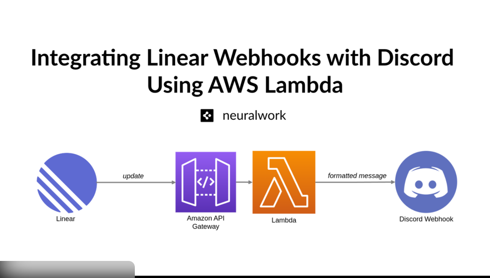

# 📉 Cloud Janitor – Orphan EBS Scanner
> **Serverless AWS cost visibility automation using Terraform**


>>>>>>> cc40511 (docs: improve README with architecture overview and deployment details)

---

## 📖 Project Description

**Cloud Janitor** is a fully serverless AWS automation tool designed to identify
**orphaned EBS volumes** (volumes in `available` state), estimate their
**monthly storage cost**, and deliver a consolidated report to **Discord**.

The solution is provisioned entirely using **Terraform (IaC)** and runs on a
**daily schedule** via **EventBridge Scheduler**, requiring no servers,
no manual execution, and minimal operational overhead.

### Key Features & Skills Demonstrated
- ✅ **Infrastructure as Code:** Full lifecycle management with Terraform
- ✅ **Serverless Architecture:** AWS Lambda & EventBridge for zero-maintenance compute
- ✅ **FinOps Mindset:** Automated cost estimation and cost visibility
- ✅ **Multi-Region Support:** Scans orphaned resources across multiple AWS regions
- ✅ **Least Privilege Security:** Granular IAM roles and policies

---

## ⚙️ High-Level Flow

1. **Terraform** provisions all infrastructure (IAM, Lambda, Scheduler)
2. **EventBridge Scheduler** triggers the Lambda function daily at **09:00 (Europe/Istanbul)**
3. **AWS Lambda**:
   - Reads target regions from environment variables
   - Queries EC2 APIs for orphaned EBS volumes using `boto3`
   - Estimates monthly storage cost based on volume type and size
   - Aggregates results into a structured report
4. **Discord Webhook** receives the formatted inventory and cost report
5. **CloudWatch Logs** capture execution details for observability

---

## 🏗 Architecture Components

| Component | Description |
|---------|-------------|
| **AWS Lambda** | Python 3.12 runtime, stateless execution, multi-region EBS scanning |
| **EventBridge Scheduler** | Cron-based, timezone-aware scheduler |
| **IAM** | Least-privilege roles; read-only EC2 access and log write permissions |
| **Terraform** | Declarative infrastructure provisioning and state management |

---

## 🛠 Prerequisites

Before deploying, ensure you have:

- [AWS CLI](https://aws.amazon.com/cli/) (configured with credentials)
- [Terraform](https://www.terraform.io/downloads) (v1.5+ recommended)
- A **Discord Webhook URL**

---

## 🚀 Deployment Guide

### 1. Clone the Repository
```bash
git clone https://github.com/emredogan-cloud/aws-cloud-janitor.git
cd aws-cloud-janitor

2. Configure Secrets

⚠️ Security Note: Never commit secrets to version control.

Create a local terraform.tfvars file (this file is git-ignored):
lambda_vars = {
  DISCORD_WEBHOOK_URL = "https://discord.com/api/webhooks/YOUR_WEBHOOK_HERE"
  REGIONS             = "us-east-1,eu-central-1"
}

3. Initialize & Deploy
terraform init
terraform plan
terraform apply

Type yes when prompted.

🧪 Manual Test (Optional)

You don’t have to wait for the scheduled time.
The Lambda function can be manually invoked via the AWS Console or CLI
to verify Discord notifications.

👨‍💻 Author

Emre Doğan
Aspiring AWS Solutions Architect

GitHub: https://github.com/emredogan-cloud

LinkedIn: https://www.linkedin.com/in/emre-do%C4%9Fan-657a99388/
